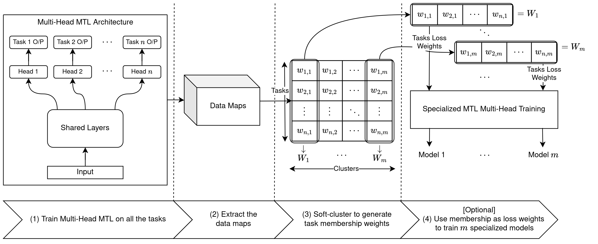
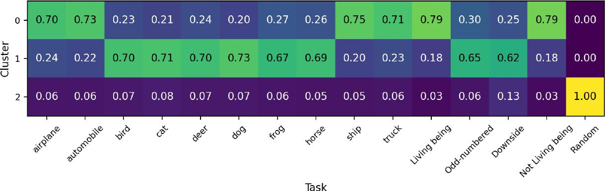
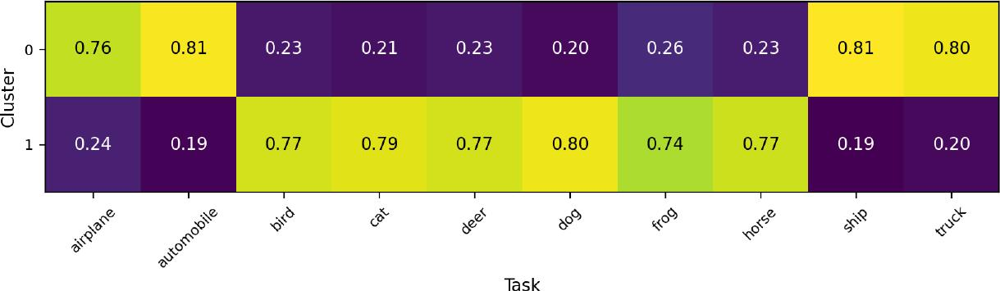
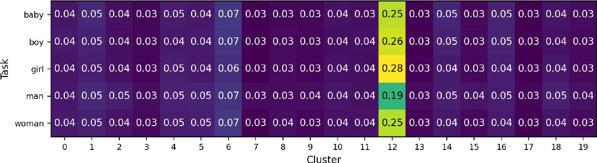
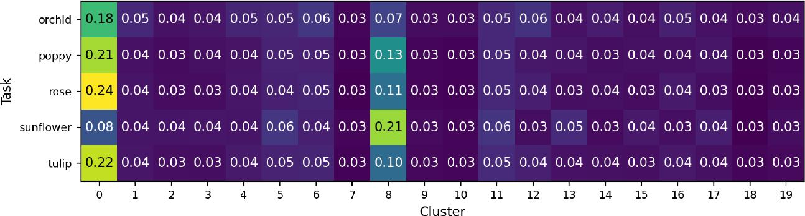
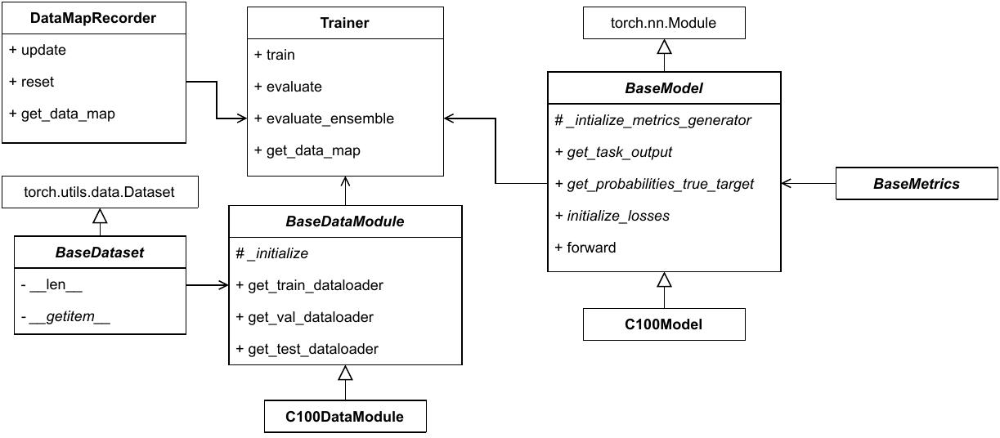

# STG-MTL: Scalable Task Grouping for Multi-Task Learning Using Data Map
Official implementation of paper (DMLR workshop @ ICML 2023)<br>
[`arXiv`](https://arxiv.org/abs/2307.03374) - [`BibTex`](#citation)

<div align=center>

</div>

# Abstract

Multi-Task Learning (MTL) is a powerful technique that has gained popularity due to its performance improvement over traditional Single-Task Learning (STL). However, MTL is often challenging because there is an exponential number of possible task groupings, which can make it difficult to choose the best one because some groupings might produce performance degradation due to negative interference between tasks. That is why existing solutions are severely suffering from scalability issues, limiting any practical application. In our paper, we propose a new data-driven method that addresses these challenges and provides a scalable and modular solution for classification task grouping based on a re-proposed data-driven features, Data Maps, which capture the training dynamics for each classification task during the MTL training. Through a theoretical comparison with other techniques, we manage to show that our approach has the superior scalability. Our experiments show a better performance and verify the method's effectiveness, even on an unprecedented number of tasks (up to **100 tasks** on CIFAR100). Being the first to work on such number of tasks, our comparisons on the resulting grouping shows similar grouping to the mentioned in the dataset, CIFAR100. Finally, we provide a modular implementation for easier integration and testing, with examples from multiple datasets and tasks.

# Highlights

1. We propose a novel data-driven method for classification task grouping in MTL, addressing the challenges of scalability and modularity, by re-proposing the usage of data maps as task features.
2. We utilize soft-clustering weights to enable model specialization via loss weighting.
3. We conduct extensive experiments, demonstrating the effectiveness of our method, even on a large number of tasks (scaling up to 100 classification tasks).
4. We provide a modular code implementation of our method, facilitating its adoption and usage by both the research and the industry communities.

# Results

We visualize the soft-clustering results for some scenarios. Refer to the paper for the full results.
<details>
<summary><h2>15 Tasks from CIFAR10</h2></summary>

<div align=center>

</div>

- notice the random task has been clustered into a cluster of its own
- our approach manages to find similarity of two identitcal tasks, `Living being` and `Not Living being`, as they have the exact same distribution
</details>


<details>
<summary><h2>10 Tasks from CIFAR10</h2></summary>

<div align=center>

</div>

- desite having no prior information, our approaches cluster machinary tasks into the same group cluster `0`
- cluster `1` have the other living creatures.
</details>

<details>
<summary><h2>Example clusters from 100 Tasks</h2></summary>

<h3>Clustering results of People tasks</h3>

<div align=center>

</div>

- our approach successfully clusters all these tasks into the same cluster, `12`

<h3>Clustering results of Flowers tasks</h3>

<div align=center>

</div>

- our approach successfully clusters all most of the tasks into the same cluster, `0`
- even though it clusters `sunflower` to cluster, `8`, we can see that it has the second highest membership of the other flower tasks

</details>

# Define your own dataset or model

<div align=center>

</div>

As shown above the code is strcutured according to the above UML. Below are some instruction to make adoption easier

- To introduce a **new dataset**, you need to inherit `BaseDataModule` class and implement the abstract methods and put the file in the directory `./data_modules/`
  - refer to `./data_modules/cifar10.py` as an example
- To introduce a **new model** architecture, you need to inherit `BaseModel` class and implement the abstract methods  and put the file in the directory `./models/`
  - refer to `./models/cifar10.py` as an example

# Usage

1. clone the repo: 
```bash
git clone --recursive https://github.com/ammarSherif/STG-MTL.git "stg_mtl"
```
2. define your own datasets/models as mentioned in [Define your own dataset or model](#define-your-own-dataset-or-model)
3. start training and record the datamaps
```python
# create an instance of the data module
data_module = C100DataModule(...)

# Now initialize a model
model = C100Model(...)

# Finally, initialize a trainer object
trainer = Trainer(model, data_module, args= args, ... )

# start training
trainer.train()
```
4. Cluster the results
```python
# get the datamap from the trainer
dm_mtl = trainer.get_data_map()

# initialize a cluster estimator
cluster_estimator = DatamapTaskClustering(dm_mtl, n_clusters, ...)

# get the results
mtl_task_weights = cluster_estimator.cluster(...)
```
5. Build a model using these memberships
```python
# create an instance of the data module
data_module = C100DataModule(...)

# Now initialize a model
model = C100Model(...)

# Finally, initialize a trainer object
trainer = Trainer(model, data_module, args= args, task_weights= mtl_task_weights[:,cluster_id], ... )

# start training
trainer.train()
```

Refer to [cifar10.ipynb](./notebooks/cifar10.ipynb) for a complete example

# Citation

```bibtex
@article{sherif2024stg,
  title={STG-MTL: scalable task grouping for multi-task learning using data maps},
  author={Sherif, Ammar and Abid, Abubakar and Elattar, Mustafa and ElHelw, Mohamed},
  journal={Machine Learning: Science and Technology},
  volume={5},
  number={2},
  pages={025068},
  year={2024},
  month={jun},
  doi={10.1088/2632-2153/ad4e04},
  url={https://dx.doi.org/10.1088/2632-2153/ad4e04},
  publisher={IOP Publishing}
}
```
